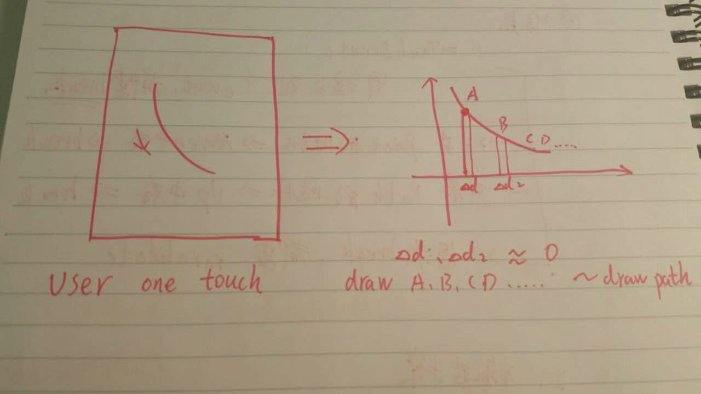

# SketchPad Principle：

Notice : Pathview not have draw function ，PointPath have

# Basis ：

 

       one touch entent log：
      action test: finger down
      action test: finger move
      action test: finger move
      action test: finger move
      action test: finger move
      action test: finger move
      action test: finger move
      action test: finger move
      action test: finger up

# Design

PointPath have drawn function：
1. save point state
2. receive  Canvas to draw

PathView controller the PointPath
1. receive Touch evnent and respond to do sth
2. save Path which can undo or invalidte
3. onDraw()  

